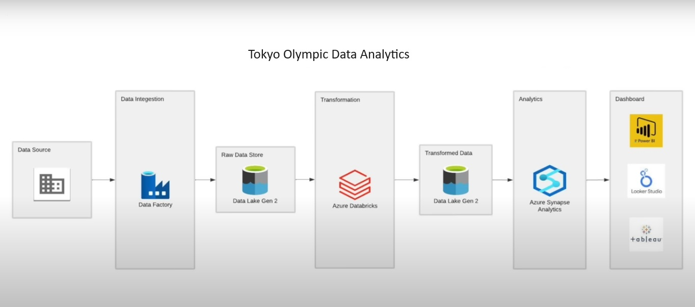

# Tokyo-Olympic-Data-Analytics

## Introduction
This project leverages Azure Data Factory and Data Lake Gen2 to extract, transform, and load Olympic data from Kaggle. By harnessing the power of data engineering, we aim to uncover valuable insights into athlete performance, country medal tallies, and viewer trends during the Tokyo Olympics.

## Architecture

## Technology Used
1. Programming Language - Python
2. Scripting Language - SQL
3. Microsoft Azure Platform
   - Azure Data Factory
   - Data Lake Gen2
   - Azure Databrocks
   - Azure Synapse Analytics

## Dataset Used
Tokyo Olympic Data
This contains the details of over 11,000 athletes, with 47 disciplines, along with 743 Teams taking part in the 2021(2020) Tokyo Olympics.
This dataset contains the details of the Athletes, Coaches, Teams participating as well as the Entries by gender. It contains their names, countries represented, discipline, gender of competitors, name of the coaches.

## More Info About Dataset
Original Data Source- https://www.kaggle.com/datasets/arjunprasadsarkhel/2021-olympics-in-tokyo

